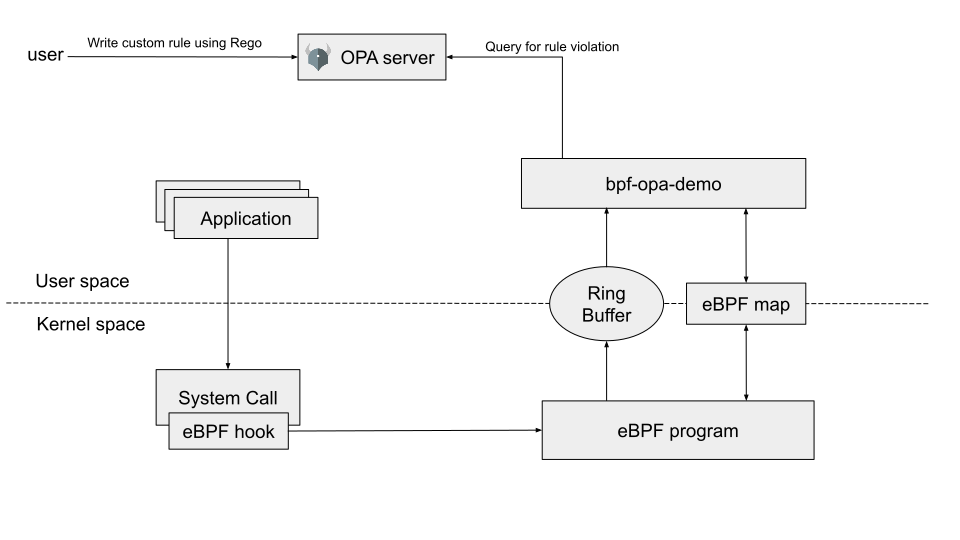

[](https://goreportcard.com/report/kubeshield.dev/bpf-opa-demo)
[](https://github.com/kubeshield/bpf-opa-demo/actions?workflow=CI)
[](https://slack.appscode.com)
[](https://twitter.com/intent/follow?screen_name=Kubeshield)

# bpf-opa-demo

## Motivation

Securing Kubernetes cluster is a multi-faceted task. Runtime security is one aspect of it. It ensures that the workloads deployed in the cluster doesn't do any malicious behaviors. For runtime instrumentation, we wanted to use Extended Berkeley Packet Filter (eBPF), a core technology in the Linux kernel.

There are already many tools available in this space, but each project has its own custom components. We want to use a set of common set of tools and techniques for binding these different components.

For runtime analysis, we already have [Falco](http://falco.org/) project. Falco was initially dependent on kernel modules, but now they are using eBPF technology.

Falco is written in C++, but Kubernetes and its associated libraries are written in Go. Having a tool that is written in Go helps us to be more integrated with kubernetes.

Falco also has its own custom rule engine. We wanted to replace Falco's rule engine with with [Open Policy Agent (OPA)](https://www.openpolicyagent.org/), an open-source, general purpose policy engine.

## Architecture

The central component of this project is the Open Policy Agent (OPA) and Extended Berkeley Packet Filter (eBPF). eBPF is a modern and powerful technology in the Linux kernel. eBPF allows a user to attach programs to certain parts of the Linux kernel. When the code path is traversed, the attached eBPF programs are executed.

The open policy agent (OPA) is an open-source, general-purpose policy engine. OPA provides a high-level declarative language called Rego. Using rego, one can write policies. The application queries OPA and supplies JSON data as input for any policy violations for the given input.

Any application running in a Linux system communicates with the kernel with the system call interface. Everything the application is doing is done through the system call interface. So if we can monitor what system calls the application is doing, we can detect if the application is doing any kind of malicious activity.

To instrument on the system call interface, we're leveraging eBPF technology. We're attaching eBPF programs to the system call interface and extracting the parameters by which the system call is invoked. Then this information is passed to the kernel perf ring buffer. Our userspace program retrieves the information from the perf ring buffer, parses the raw syscall arguments and then finally queries to the OPA server for rule violations. Users can also write their own rules using rego and supply them to the OPA server.


Fig: Diagram showing the major components of bpf-opa-demo

## Usage

> Make sure that you're running a linux machine with kernel version `4.17` or higher. We're attaching eBPF programs to `raw_tracepoints`, and this feature is available from linux kernel `4.17`. For more information, you can see [here](https://github.com/iovisor/bcc/blob/master/docs/kernel-versions.md).

Download `Open Policy Agent` from [github release page](https://github.com/open-policy-agent/opa/releases). Start the OPA server

```bash
opa run -s
```

Download `bpf-opa-demo` binary from [github release page](https://github.com/kubeshield/bpf-opa-demo/releases). Run the binary with root permissions.

```bash
sudo ./bpf-opa-demo
```

You can use the open policy agent's [rest-API](https://www.openpolicyagent.org/docs/latest/rest-api/) to update the default rules and add your own rules.

When you run something that violates the rules, the program will print to the stdout the input with which it is queried

```json
{
  "modify_shell_configuration_file": {
    "event": {
      "len": 87,
      "name": "openat",
      "nparams": 6,
      "params": {
        "dev": 2049,
        "dirfd": 18446744073709552000,
        "fd": 3,
        "flags": 14,
        "mode": 438,
        "name": "/home/tahsin/.bashrc"
      },
      "tid": 30828,
      "ts": 27562555577941,
      "type": 307
    },
    "process": {
      "args": [
        "/home/tahsin/.bashrc"
      ],
      "cgroup": [
        "cpuset=/",
        "cpu=/user.slice",
        "cpuacct=/user.slice",
        "io=/user.slice",
        "memory=/user.slice/user-1001.slice/session-2.scope"
      ],
      "command": "nano",
      "executable": "nano",
      "name": "",
      "parent": {
        "args": [],
        "cgroup": [
          ""
        ],
        "command": "/usr/bin/fish",
        "executable": "/usr/bin/fish",
        "name": "fish",
        "parent": null,
        "pid": 30573,
        "ppid": 0
      },
      "pid": 30828,
      "ppid": 30573
    }
  }
}
```

This indicates that the process `nano` did the system call `openat` to edit the file `.bashrc`. Here `process.cgroup` is empty as we're running this from our host machine. If we run time same thing from the container, we get the following output

```json
{
  "read_shell_configuration_file": {
    "event": {
      "len": 80,
      "name": "openat",
      "nparams": 6,
      "params": {
        "dev": 102,
        "dirfd": 18446744073709552000,
        "fd": 3,
        "flags": 1,
        "mode": 0,
        "name": "/root/.bashrc"
      },
      "tid": 384,
      "ts": 29654919403736,
      "type": 307
    },
    "process": {
      "args": [
        "/root/.bashrc"
      ],
      "cgroup": [
        "cpuset=/docker/41e5c07cc31073cfcad80176bf5195d04d4511cfdaba0205ac149112579a03c9",
        "cpu=/docker/41e5c07cc31073cfcad80176bf5195d04d4511cfdaba0205ac149112579a03c9",
        "cpuacct=/docker/41e5c07cc31073cfcad80176bf5195d04d4511cfdaba0205ac149112579a03c9",
        "io=/docker/41e5c07cc31073cfcad80176bf5195d04d4511cfdaba0205ac149112579a03c9",
        "memory=/docker/41e5c07cc31073cfcad80176bf5195d04d4511cfdaba0205ac149112579a03c9"
      ],
      "command": "cat",
      "executable": "cat",
      "name": "",
      "parent": {
        "args": null,
        "cgroup": null,
        "command": "",
        "executable": "",
        "name": "",
        "parent": null,
        "pid": 0,
        "ppid": 0
      },
      "pid": 384,
      "ppid": 32735
    }
  }
}
```

You can see that the `process.cgroup` now has the docker container ID from which the command was run on.

## Findings

When doing this project, we found some limitations of rego.

- You can not write complex rules inside a single rule body. When evaluating rule bodies, OPA searches for variable bindings that make all of the expressions true. There may be multiple sets of bindings that make the rule body true. The rule body can be understood intuitively as: `expression-1 AND expression-2 AND ... AND expression-N `. In order to use `OR`, you have to define a rule multiple times. An incrementally defined rule can be intuitively understood as `<rule-1> OR <rule-2> OR ... OR <rule-N>`. So writing complex rules that involve multiple nested `AND` and `OR` expressions are very painful. For example, this following rule checks if `ncat` process was run with some arguments, so we had to write rules for each argument separately.

```
Netcat_Remote_Code_Execution = input {
	nc_process
}
Netcat_Remote_Code_Execution = input {
	ncat_process
}
```

```
ncat_arg_contains_exe {
     contains(input.process.args[_], "--sh-exec")
}
ncat_arg_contains_exe {
     contains(input.process.args[_], "--exec")
}
ncat_arg_contains_exe {
     contains(input.process.args[_], "-e ")
}
ncat_arg_contains_exe {
     contains(input.process.args[_], "-c ")
}
ncat_arg_contains_exe {
     contains(input.process.args[_], "--lua-exec")
}
```

- You can not do bitwise operations in rego. For example, to check if `O_RDONLY` flag set on `open` syscalls, we had to do the following

```
O_RDONLY := 1

is_open_read {
	round((input.event.params.flags-0.1) / O_RDONLY) % 2 > 0
}
```

- Rego doesn't support any kind of loops, if else blocks etc. We can write more complex rules if it has support for these.


## Acknowledgements

- We're using eBPF code from the [sysdig project](https://github.com/draios/sysdig/tree/master/driver/bpf).
Follow [this guide](https://falco.org/docs/source/) from the falco project for building the eBPF codes.
Then copy the compiled elf file to `bpf/probe.o`

- We're using default rules from the [falco project](https://github.com/falcosecurity/falco/blob/master/rules/falco_rules.yaml) and rewriting them in rego, the policy language from Open Policy Agent(OPA).
